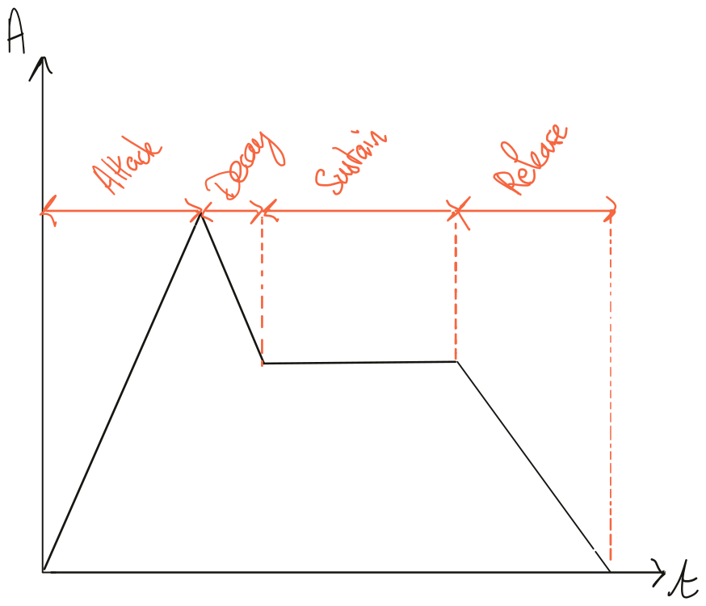
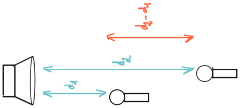
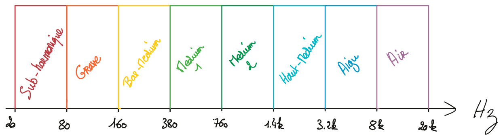

# Quantifier et qualifier le son

Le son peut s'appréhender de plusieurs façons différentes. Particulièrement, sa description physique et psychoacoustique est très précieuse pour tous les praticiens du son. Il convient donc, afin de pouvoir proposer un dispositif cohérent de prise de son, de comprendre la physique élémentaire du son ainsi que d'être capable de le décrire efficacement. 

## Quelques définitions

Le son est une vibration mécanique d'un fluide. Dans le cadre de ce cours, nous ne considérerons que l'air comme médium de propagation. Cette onde cause une variation de la pression dans l'espace. Nous, les êtres humains, le percevons grâce à notre ouïe. Il s'agit donc, par définition, d'un phénomène ondulatoire et peut être caractérisé par un nombre d'oscillations par seconde, aussi appelé fréquence. On estime que notre espèce est sensible aux fréquences allant de 20 Hz (très grave) jusqu'à 20 000 Hz (très aigu).

Les sons composés d'une seule fréquence se nomment **sons purs**. Cependant, de tels signaux n'existent pas dans la nature, et sont souvent utilisés afin de réaliser des mesures ou des tests psychoacoustiques. 

```{r, echo=FALSE, out.width="50%", fig.show = 'hold', fig.cap = "Représentation d'un son pur : (1) domaine temporel ; (2) domaine fréquentiel"}
knitr::include_graphics(rep(c("_resources/drawings/sinus_tps.svg","_resources/drawings/sinus_fqc.svg")))
```

Dans notre environnement, les sons sont donc composés de plusieurs fréquences. La fréquence la plus grave d'un son est sa **fréquence fondamentale**. Les autres sont alors appelées **partiels**. Si ces partielles ont pour fréquence un multiple de la fréquence fondamentale, alors on les nomme **harmoniques**.

> 💡 Plus généralement, on admettra que la composition fréquentielle, ou spectrale, de tout son peut être décomposée par une somme de sinusoïde. L'outil permettant de passer de la représentation temporelle d'un signal à sa représentation fréquentiel s'appelle la **transformée de Fourrier.** 

```{r, echo=FALSE, out.width="50%", fig.show = 'hold', fig.cap = "Représentation d'une onde carrée qui ne contient que les harmoniques impaires."}
knitr::include_graphics(rep(c("_resources/drawings/square_tps.svg","_resources/drawings/square_fqc.svg")))
```

La fréquence fondamentale donne la **hauteur** du son (sa note en musique par exemple). Les partiels enrichissent cette fréquence fondamentale et créés le **timbre** d'un son. C'est en partie grâce au timbre que l'on peut reconnaître différents instruments de musiques jouant la même note.

Un son se caractérise également par l'évolution de son amplitude au cours du temps. On parle alors de son **enveloppe**. Un modèle courant d'enveloppe est l'ADSR : *Attack*, *Decay*, *Sustain*, *Release*, soit *Attaque*, *Décroissance*, *Maintient* et *Relâchement*.

```{r, echo=FALSE, out.width="65%", fig.align="center", fig.cap = "Exemple d'enveloppe ADSR"}

```

Lorsque son temps et très bref, l'ensemble *attaque* et *décroissance* forme les **transitoires**. Cette partie du signal est responsable de la sensation percussive du son.

## La relation entre temps, distance et fréquence

Il est important de garder à l'esprit que les notions de temps, de fréquence et de distance sont étroitement liées. Nous avons vu ci-dessus que tous les sons peuvent être décrits par une somme de sinusoïde. Leur fréquence la plus grave, dite fondamentale, permet de définir la **période**. La période est le temps que met un signal à répéter son motif oscillatoire (voir schémas 3.1 et 3.2). Le lien mathématique entre fréquence et période est très simple, car l'un est l'inverse de l'autre :

$$ f = \frac 1 T $$

Si nous étudions les fréquences extrêmes, audibles par notre ouïe, nous trouvons que pour $f_{min} = 20 \,Hz$, sa période $T_{f_{min}} = 50 \,ms$. Pour $f_{max} = 20\,000 \,Hz$, $T_{f_{max}} = 0.5 \,ms$.

Une onde sonore est également caractérisée par sa **célérité**. Celle-ci est constante dans un milieu donné. Dans l'air, à une température de $15 \,°C$ et au niveau de la mer, sa célérité $c$ est de $340\,m.s^{-1}$. On admettra cette valeur pour réaliser l'ensemble de nos différents calculs.

Comme son unité l'indique, la célérité du son est homogène à une distance divisée par un temps, soit :

$$ c =\frac d t $$

Suivant cette formule, nous pouvons alors calculer la **longueur d'onde** correspondant à une fréquence. La longueur d'onde se note $\lambda$. 

$$ \lambda = cT \; \iff \; \lambda = \frac c f$$

Si nous étudions à nouveau les bornes minimale et maximale de notre audition, nous trouvons que $\lambda_{f_{min}} = 17 \,m$ et $\lambda_{f_{max}} = 17 \,mm$.

Nous pouvons également calculer le temps de propagation du son. En pratique, nous serons souvent intéressés par le temps de propagation séparant deux points dans l'espace (par exemple, le temps séparant deux microphones par rapport à un instrument).

```{r, echo=FALSE, out.width="25%", fig.align="center", fig.cap = "Distance entre deux microphones."}

```

$$ t = \frac {d_2-d_1}{c}$$

## La perception du son

Nous avons abordé quelques notions physiques permettant de mieux caractériser le phénomène sonore. Comme indiqué au début de ce chapitre, le son peut également être discuté sous l'angle de notre ouïe, et donc, de notre perception. Cette branche de la science se nomme la psychoacoustique et cherche à étudier la façon dont nous percevons le son.

Notre corps, et a fortiori notre cerveau, sont des machines extrêmement complexes. Nous sommes équipés d'une multitude de capteurs permettant de sentir le contact d'une matière, des odeurs, d'entendre, de goûter, de voir, de positionner nos membres dans l'espace, de ressentir la douleur, etc. Pris indépendamment, chacun de ces sens est déjà un phénomène complexe à décrire, mais il existe en plus une grande interdépendance entre ceux-ci. Par exemple, l'interdépendance entre la vision et l'audition est à l'origine d'un certain nombre de mécanismes biaisant notre écoute.

Nous nous bornerons au fil de ce cours à quelques notions liées à l'ouïe et à son interdépendance à d'autre sens quand cela sera pertinent.

### Spectre, timbre et vocabulaire

<!--CComme évoqué précédemment, il est communément admis que les êtres humains entendent des sons ayant pour fréquence des valeurs comprises entre 20 Hz et 20 kHz. Cette borne supérieure est par ailleurs plutôt théorique. Avec l’âge, voire selon l’hygiène de vie (exposition à de forts niveaux sonores), cette valeur aura tendance à diminuer..-->

D'un point de vue perceptif, le spectre d'un son est une chose facilement remarquable. Il est, par contre, beaucoup plus difficile à qualifier. Il n'est pas rare de rencontrer les adjectifs "chaud", "brillant", "rond", "aéré", "ouvert", "sombre", voir des qualificatifs encore plus ésotérique, pour tenter de communiquer la sensation ressentie à l'écoute de tel ou tel son.

Cette difficulté liée à l'absence de vocabulaire commun quant à la qualification des sons emmène systématiquement la redéfinition de ce vocable en fonction de son interlocuteur. En effet, le mot "rond" ne signifiera pas forcément la même chose pour différentes personnes. Une stratégie possible consiste à questionner son interlocuteur sur l'utilisation de ses adjectifs tout en cherchant à y associer des exemples sonores.

Nous pouvons tout de même nous essayer à cet exercice pour nous permettre d'avoir un vocabulaire commun au fil de ce cours. Vous aurez sans doute compris qu'il n'y aura, dans les termes employés, aucun critère absolu.

```{r, echo=FALSE, out.width="85%", fig.align="center", fig.cap = "Distance entre deux microphones."}

```

> 💡 Proposition d'association entre bandes de fréquences et sensation.
> 
> + **20 Hz — 80 Hz** : Subharmonique, sensation tripale
> + **80 Hz — 160 Hz** : Grave, sensation d’assise
> + **160 Hz — 380 Hz** : bas-médium, sensation de « chaleur », voir « boueux »
> + **380 Hz — 1400 Hz** : Medium, sensation de « boîte » quand trop présent, sonne « creux » quand trop absent
> + **1400 Hz — 3200 Hz** : Haut-medium : zone de sensibilité maximale de l’oreille.
> + **3200 Hz — 8000 Hz** : Aigu, apporte de la précision voir de l’agressivité
> + **8000 Hz — 20 000 Hz** : Air, apporte une sensation d’ouverture voir de finesse

Il est également important de savoir que les fréquences graves ont un effet masquant sur les fréquences plus aiguës. Ce phénomène est dû au fonctionnement de notre oreille, et plus particulièrement de la cochlée.

### La pression acoustique

Notre oreille n’a pas une réponse en fréquence linéaire en fonction du niveau sonore.

Plus le niveau de pression acoustique est faible, plus le son paraîtra médium. Plus il est fort, plus le son semblera ouvert dans le grave et l’aigu.

Ce phénomène est décrit par les courbes d’isosonie de Fletcher-Munson. Chaque ligne rouge représente une sensation de niveau sonore égale en fonction de la fréquence.

```{r, echo = FALSE, fig.cap = 'Courbes de Fletcher-Munson'}
knitr::include_graphics(path = "_resources/094d33e2494c70d2395225081ede1162.png")
```

### L'évaluation de la distance

La plupart des paramètres permettant d'évaluer la distance d'un son sont relatifs. Cela signifie que le son doit être comparé à un autre pour pouvoir le repositionner dans l'espace.

+ Plus le volume d'une source est élevé, plus celle-ci paraît proche.
+ Plus une source est brillante, plus celle-ci paraîtra également proche.
+ Plus la réverbération attachée à une source est présente, plus cette dernière paraît loin
