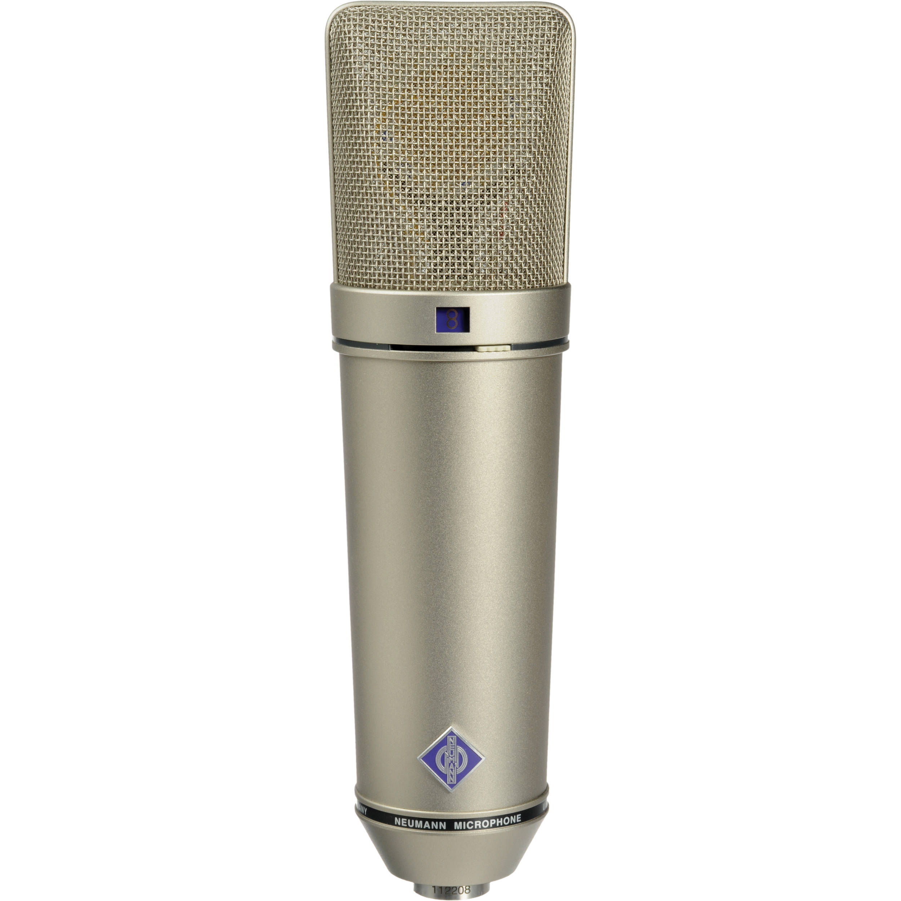
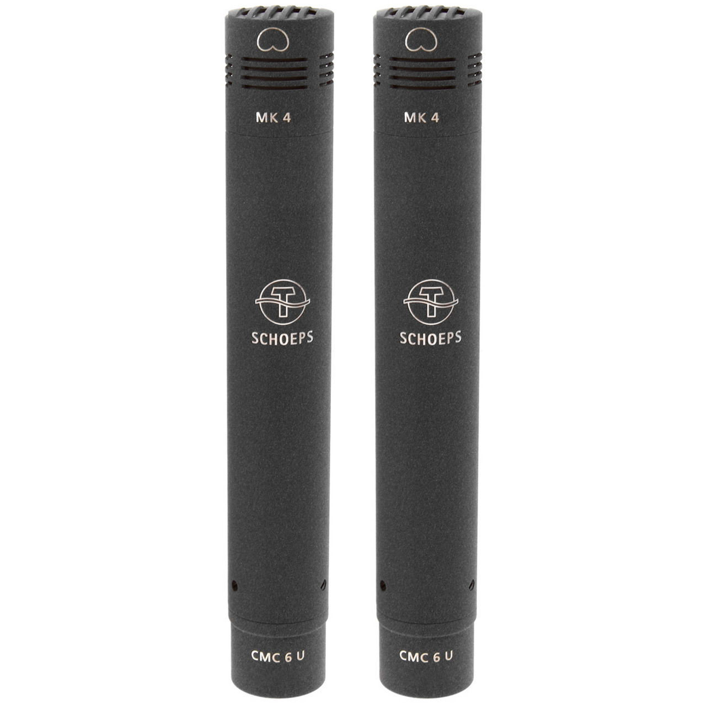
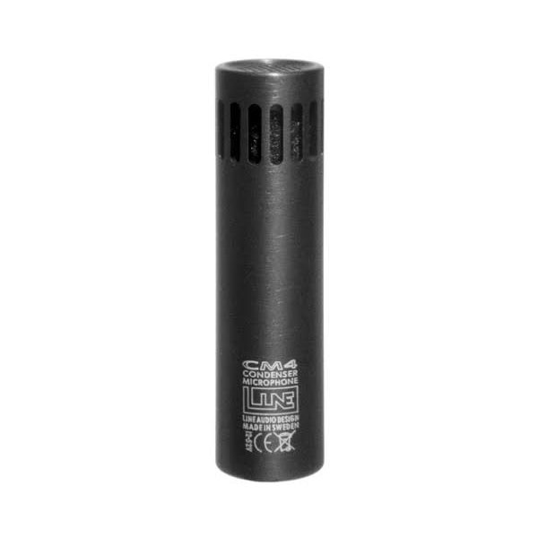
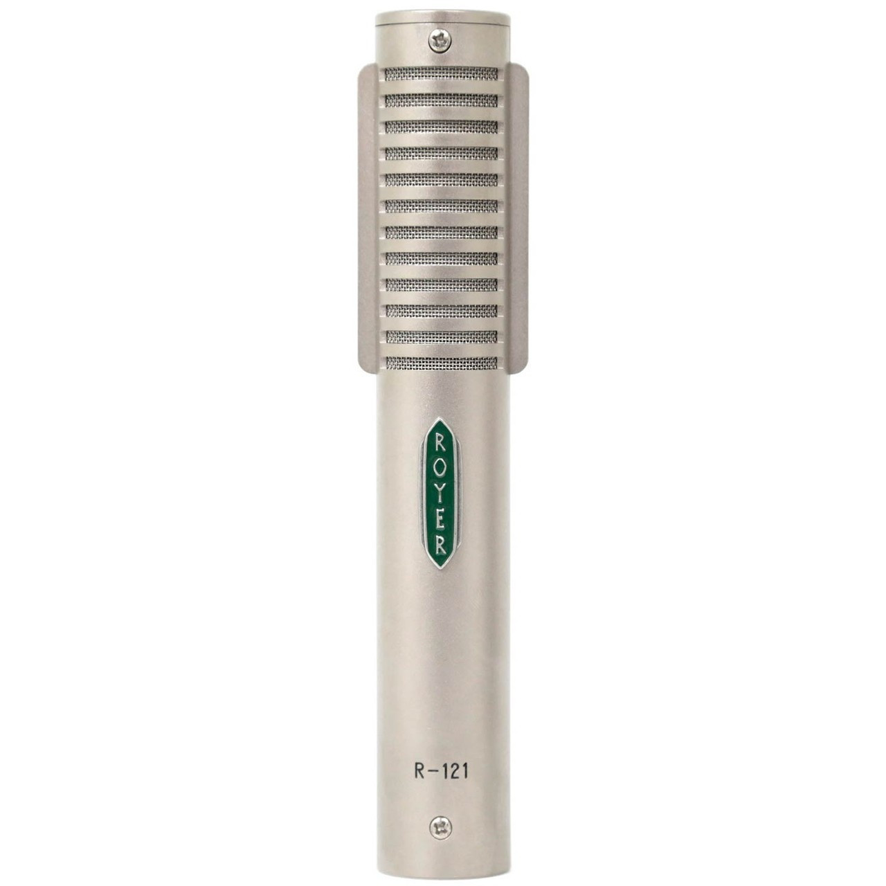
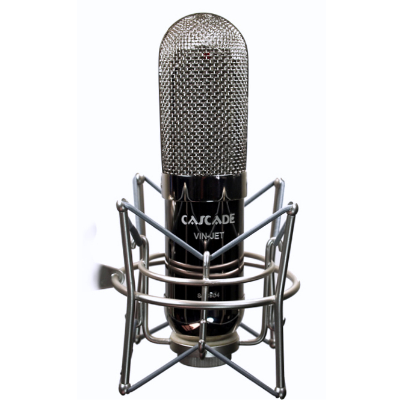
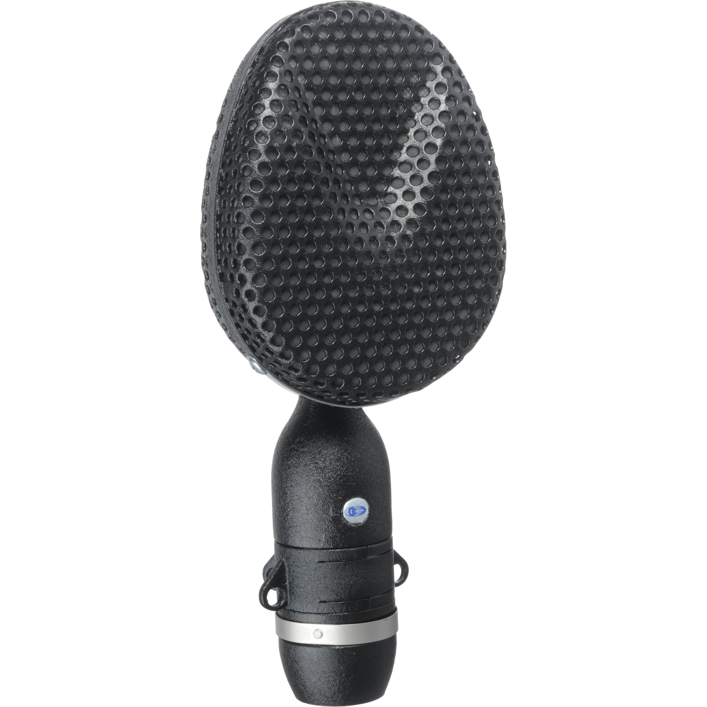
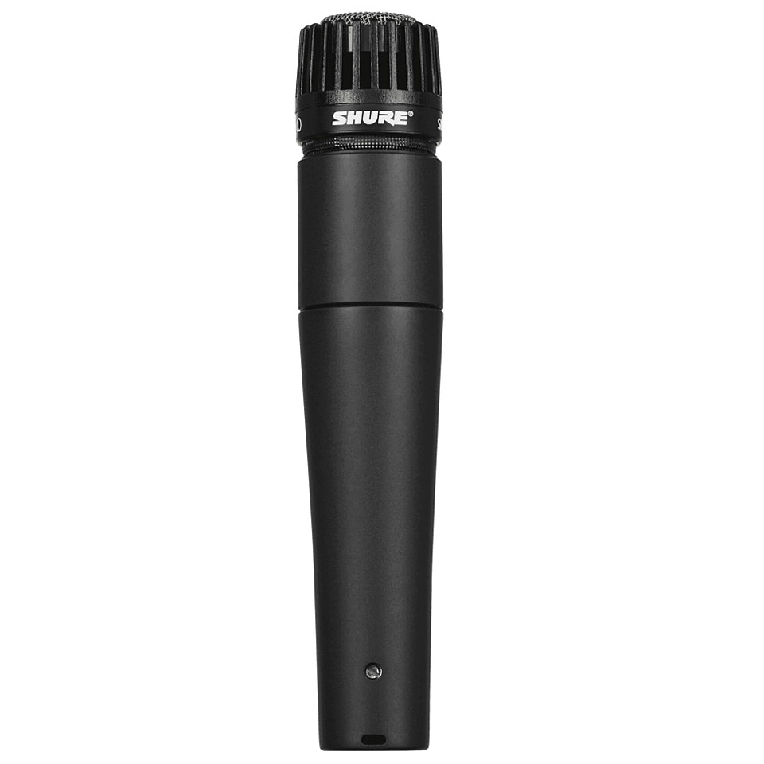
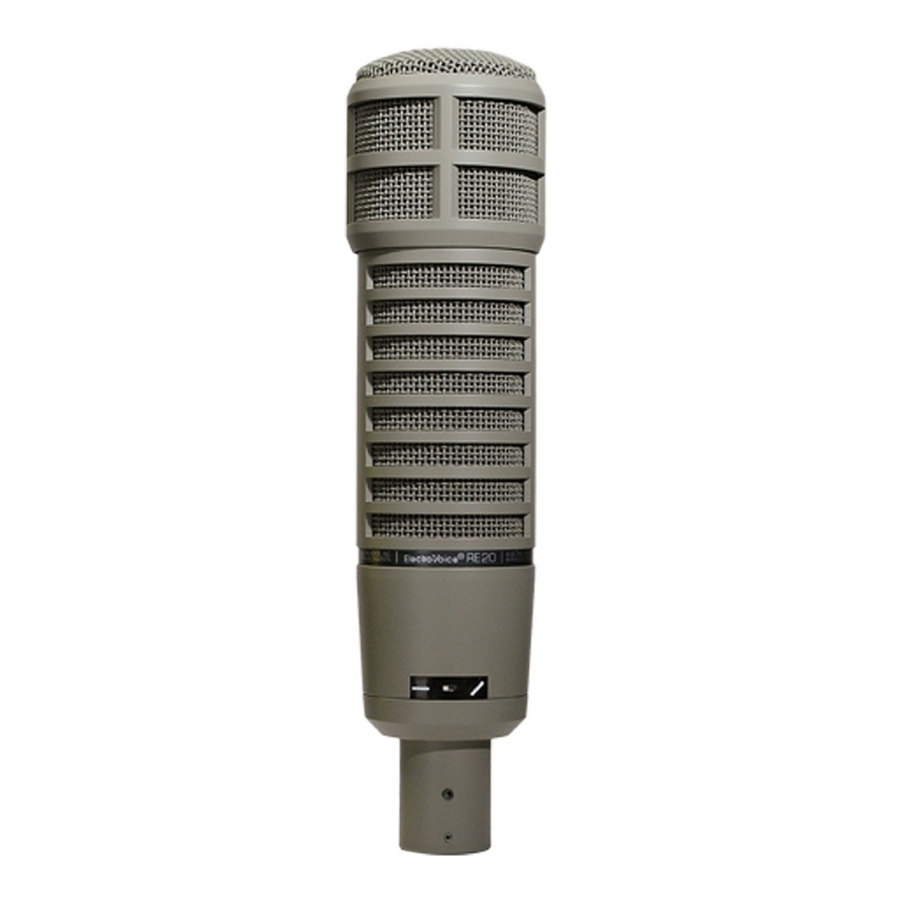
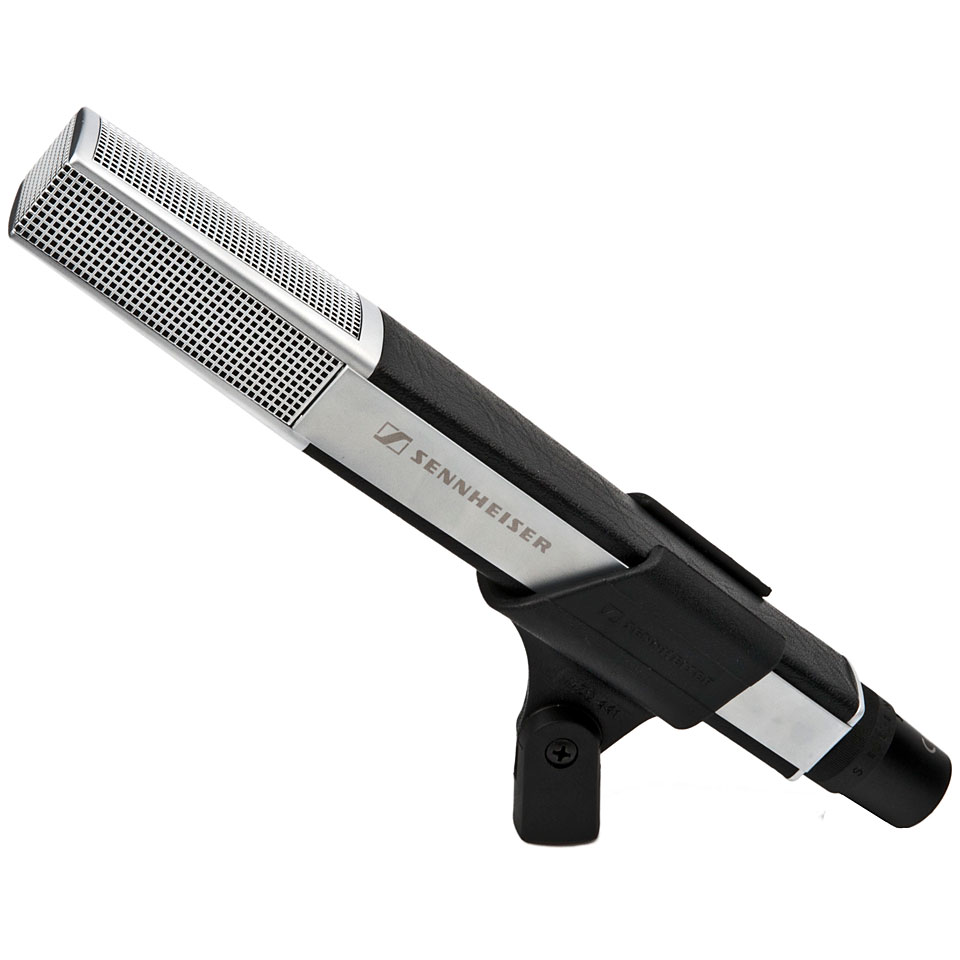

# Les microphones

Un microphone est un **transducteur** permettant de transformer une onde acoustique en signal électrique. Cette opération est réalisée par une membrane. Selon la nature du microphone, cette membrane pourra être constituée d’une feuille métallique d’un condensateur ou encore être rattachée à une bobine.

Le microphone est l’outil principal du preneur de son. Le choix du modèle et sa position dans l’espace est déterminants sur le rendu sonore d’une captation. Ces deux paramètres ont par ailleurs une certaine interdépendance : une position souhaitée du microphone pouvant influencer le choix du modèle et vice-versa.

## Petit historique des microphones

Sans vouloir rentrer dans un récit exhaustif sur l’invention et l’évolution des microphones, relater les moments clefs de cette technologie permet d’avoir une vision globale du marché d’aujourd’hui.

La nécessité de capter un évènement sonore grâce à un microphone provient de trois besoins :

+ le transmettre (télécommunication)
+ l’amplifier (concert, spectacle vivant)
+ l’enregistrer (industrie du disque)

En 1876, Alexandre Graham Bell propose un système à base liquide, permettant de transformer une onde sonore en tension électrique. Le système ne fut jamais réellement exploité, car le rendu sonore était jugé trop peu satisfaisant.

Le premier type de microphone utilisé industriellement est le **microphone à charbon** (au UK, par David Edward Hugues, aux US par Emile Berliner et Thomas Edison. Le brevet sera d’ailleurs disputé, avec un gain de cause pour Edison malgré des démonstrations publiques de Hugues antérieur aux publications d’Edison). En raison de sa faible bande passante et de son niveau de bruit élevé, il se révèle de piètres qualités pour l’enregistrement et la transmission de la musique. Il aura, par contre, une place de choix dans les téléphones durant de longues décennies.

Viennent ensuite les **microphones à condensateur**, dont les premiers modèles remontent à 1916, par le chercheur Edward Wente. Ces microphones sont tout d’abord réputés assez capricieux, leurs réponses en fréquences pouvant varier significativement en fonction de l’humidité de l’air et de la température.

À cause de ces variations sonores présentes dans les premiers microphones à condensateur, on leur préférera un temps les **microphones à ruban**. Ils sont inventés en 1923 par Harry Olson. Ils sont par contre d’une grande fragilité mécanique. 

George Neumann est un des noms à connaître dans cette histoire des microphones. On lui doit, entre autres, la stabilisation des microphones statiques. Il sera aussi le premier à produire un microphone (U87) utilisant un transistor en lieu et place des traditionnels tubes.

À partir des années 1970, les microphones dynamiques arrivent sur le marché, notamment porté par la marque Shure. Ces microphones ont la grande qualité d’être très robustes, et remplaceront leurs homologues à ruban dans bien des cas.

Depuis, les principales améliorations ont concerné la robustesse d’une part, et la miniaturisation des dispositifs d’autre part, menant ainsi au développement des capsules MEMS.

## Les types et technologies de microphones

Avant d’aborder en détail certaines constructions de microphones, il convient de faire attention à certains raccourcis associant des méthodes de fabrications à un niveau présumé de qualité. Par exemple, il est commun d’associer les microphones à électret à une construction « bas de gamme ». Or, c’est oublier que la série 4000 de chez DPA, considérée par beaucoup comme une référence indétrônable de la prise de son, ne contient que des microphones à électret. Les MEMS souffrent du même biais, ceux-ci se retrouvent pourtant de plus en plus souvent sur des microphones ambisoniques, comme le Zyla ou le SPC mic.

Nous allons maintenant aborder les types de microphones suivants :

+ Les microphones électrostatiques/à condensateur
+ Les microphones à ruban
+ Les microphones dynamiques

### Les microphones électrostatiques/à condensateur

```{r, echo=FALSE, fig.cap="Neumann U87, Schoeps CMC64, Line Audio CM4", fig.show="hold", fig.align="center", out.width="33%"}





```

Ce sont, historiquement, les premiers microphones à permettre une captation du spectre audible satisfaisante. Ils sont cependant très sensibles aux conditions de température et d’humidité et il fallut attendre les années trente pour que ce problème cesse. Ils nécessitent une alimentation externe, appelée alimentation fantôme, normalisée à +48V. Il existe deux familles de microphones électrostatiques, les **condensateurs à hautes fréquences** et **condensateur polarisés en courant continu**.

Les microphones à condensateur polarisés en courant continu ont le fonctionnement le plus commun. Un courant continu vient polariser la capsule/condensateur. Lorsqu’une onde sonore rencontre la capsule, une de ses armatures se déforme et génère une variation de tension analogue à la variation de pression.

Les microphones à condensateur à haute fréquence proposent une approche différente. Un oscillateur est intégré dans le microphone et la variation de pression enregistrée par le condensateur vient moduler la fréquence de cet oscillateur. Le signal est ensuite démodulé dans la plage audible. Cette méthode de construction offre une impédance de sortie plus faible et une plus grande résistance aux variations de conditions climatiques.

Concernant leurs caractéristiques, ces microphones possèdent des réponses en fréquence souvent très linéaire et une excellente réponse en transitoire. Leur niveau de sortie (sensibilité) est élevé. Leur impédance de sortie est basse.

Exemples : Neumann U87/AKG C414/Shoeps CMC4/Série 4000 DPA/Série MKH Sennheiser

### Les microphones à ruban

```{r, echo=FALSE, fig.cap="Royer R121, Cascade Vinjet, Coles 4038", fig.show="hold", fig.align="center", out.width="33%"}





```

Les microphones à ruban souvent préférés à leurs homologues statiques dans les débuts de la musique enregistrée. Leur fonctionnement repose sur l’utilisation d’une feuille métallique placée entre deux aimants. Lorsqu’une onde sonore rencontre cette feuille (le ruban), celle-ci vibre et perturbe le champ électromagnétique créé par les aimants et génère une tension analogue à la variation de pression.

D’un point de vue sonore, les microphones à ruban ont souvent un bas du spectre assez généreux et une réponse plutôt douce pour les hautes fréquences. Ils sont aussi connus pour avoir une impédance de sortie assez élevée et un niveau de sortie faible. Attention à l’alimentation fantôme (+48V), elle peut endommager le microphone.

Exemples : Royer R121/Cohles/Beyerdynamic M160

### Les microphones dynamiques

```{r, echo=FALSE, fig.cap="Shure SM57, Electro-Voice RE20, Sennheiser MD441", fig.show="hold", fig.align="center", out.width="33%"}





```

Les microphones dynamiques sont conçus pour des conditions d’utilisation rudes, où les niveaux sonores sont élevés et où le risque de chute est important. Ils sont donc monnaie courante en sonorisation. Leur membrane est attachée à une bobine entourant un aimant. Lorsqu’une onde sonore la met en vibration, la bobine se déplace autour de l’aimant, et, par perturbation du champ électromagnétique, génère une tension de sortie analogue à la variation de pression.

Leur réponse en fréquence est souvent accidentée, particulièrement dans le haut du spectre. Cela peut être vu comme un inconvénient ou comme un outil de « coloration » du son. Comme leurs homologues à ruban, ils possèdent un niveau de sortie faible et une impédance de sortie élevée.

Exemples : Shure SM57/Electrovoice RE20/Sennheiser MD441

### La taille des membranes

La taille des membranes influe sur la captation du son. Plus la capsule est grande, plus les fréquences aiguës seront diffractées et donc atténuées dans la prise de son. Un microphone à petite membrane est donc techniquement un microphone plus « juste ». Cependant, l’emploi de large membrane permet aussi d’adoucir un surplus d’énergie dans le haut du spectre.

### Microphones à tubes ou transistors?

Historiquement, les tubes ont été les premiers composants électroniques à permettre l’amplification du signal. Le transistor est apparu à la fin des années 40 et a permis de remplir les mêmes fonctions qu’un tube, par une consommation moindre et avec un encombrement beaucoup plus faible.

Certains microphones continuent à être fabriqués avec des tubes, préférant leur comportement vis-à-vis du son. Une écrasante majorité est cependant fabriquée avec des transistors.

Le choix entre un microphone à tube et un microphone à transistor semble cependant anecdotique par rapport à son type, à son placement et à sa directivité.

## Timbre et directivité

La directivité d’un microphone permet de décrire sa capacité à réaliser une « écoute » sélective de son environnement. On rencontre les directivités suivantes : 

+ Omnidirectionnel : capte l’ensemble du champ sonore de façon indifférenciée.
+ Hypercardioïde : compromis entre Omnidirectionnel et cardioïde.
+ Cardioïde : capte à l’avant, mais rejette à l’arrière du microphone.
+ Supercardioïde : ressers la zone d’écoute avant au prix de l’apparition d’une résurgence arrière.
+ Hypercardioïde : ressers davantage la zone d’écoute et augmente d’autant plus la résurgence arrière.
+ Bidirectionnel : capte à l’avant et à l’arrière, mais selon un lobe plus resserré qu’en cardioïde.

```{r, echo=FALSE, fig.align="center", warning = FALSE, message = FALSE}

library(plotly)

df <- read.csv("https://raw.githubusercontent.com/plotly/datasets/master/polar_dataset.csv")

fig <- plot_ly(
  df,
  type = 'scatterpolar',
  mode = 'lines'
  
  ) 

fig <- fig %>%
  add_trace(
    r = ~x1,
    theta = ~y,
    name = 'Figure en 8',
    line = list(
      color = 'peru'
    )
  ) 

fig <- fig %>%
  add_trace(
    r = ~x2,
    theta = ~y,
    name = 'Cardioïde',
    line = list(
      color = 'darkviolet'
    )
  ) 

fig <- fig %>%
  add_trace(
    r = ~x3,
    theta = ~y,
    name = 'Hypercardioïde',
    line = list(
      color = 'deepskyblue'
    )
  ) 

fig <- fig %>%
  add_trace(
    r = ~x4,
    theta = ~y,
    name = 'Subcardioïde',
    line = list(
      color = 'orangered'
    )
  ) 

fig <- fig %>%
  add_trace(
    r = ~x5,
    theta = ~y,
    name = 'Supercardioïde',
    line = list(
      color = 'green'
    )
  )

if (knitr::is_latex_output())
  {
    trash <- capture.output(orca(fig, "_resources/plotly/test.svg"))
    show_fig("_resources/plotly/test.svg")
  } else {
    fig
  }

```

Plus la directivité d’un microphone est large, plus la contribution de l’acoustique est apparente. Le timbre est également aussi linéaire que possible. À l’inverse, plus la directivité tant à être étroite, plus le microphone aura une capacité à échantillonner seulement une zone de l’espace. Le timbre est, par contre, amoindri dans le bas du spectre. Les microphones omnidirectionnels sont donc les plus larges et les plus « neutres », tandis que les microphones bidirectionnels sont les plus focalisés et ont la plus importante perte dans le bas du spectre.

Le preneur de son choisit donc une directivité en fonction de la tâche à accomplir. Les microphones directifs ont l’avantage de limiter la contribution d’évènements sonores que l’on ne souhaite pas capter. Les microphones omnidirectionnels ont la faculté d’être un dispositif de prise de son plus transparent, mais seront beaucoup plus sensibles à une acoustique moins optimale, ainsi qu’au bruit environnant.

Nous allons par la suite nous intéresser au cœur du microphone : sa capsule. Il existe deux familles de capsules, celles dites « à pression », et celles dites à « gradient de pression ».

### Capsules à pression

Une capsule sensible à la pression est omnidirectionnelle : elle capte les fluctuations de pressions en un point. Mathématiquement, cette relation s’exprime, en coordonnées polaires, par :

$$ \theta = 1 $$

L’angle d’incidence de l’onde sonore par rapport au microphone importe donc peu.

Pour réaliser une capsule à pression, on enferme une partie de la membrane dans un milieu acoustique à pression constante.

### Capsules à gradient de pression

Une capsule à gradient de pression est sensible à la **variation** du champ de pression. Ces capsules ne sont plus omnidirectionnelles, mais bidirectionnelles : elles captent devant et derrière elles. Mathématiquement, une telle directivité s’exprime par la relation (en coordonnées polaires) :

$$ \theta = cos(\alpha) $$

Où $\alpha$ est l’angle d’incidence d’un son par rapport à la capsule.

Pour réaliser une capsule à gradient de pression, il suffit de laisser exposer les deux faces de la membrane aux variations de pressions.

### Et les autres directivités ?

Il est possible, à partir des deux équations ci-dessus, de retrouver toutes les autres directivités. Par exemple, un microphone cardioïde a une équation de directivité polaire tel que :

$$ \theta(\alpha) = \frac{1}{2}(1 + cos[\alpha]) $$

Elles découlent donc des deux directivités primaires : omnidirectionnelle et bidirectionnelle. Pour obtenir une directivité particulière, il suffit de « doser » l’influence de ces deux directivités. Par exemple, un microphone cardioïde possède une contribution égale de chacune d’elles. Plus on augmente la proportion de la directive bidirectionnelle, plus on tend vers un microphone supercardioïde, voire hypercardioïde. À l’inverse, augmenter la proportion de la directivité omnidirectionnelle fait tendre le microphone vers une directivité hypocardioïde.

Il existe deux solutions pour agir sur la contribution des directivités primaires. La première consiste à utiliser un labyrinthe acoustique pour changer le milieu acoustique d’une des faces de la membrane. L’autre consiste à avoir une capsule omnidirectionnelle et une seconde bidirectionnelle et de sommer leur tension de sortie.

Les microphones à multidirectivité permettent à l’utilisateur d’influer, soit sur le labyrinthe acoustique, soit sur la sommation des deux capsules. Il n’est pas rare que ces microphones soient moins performants qu’un microphone spécifiquement dédié à une seule directivité.

On retiendra donc :

$$ \theta(\alpha) = A + B \cos (\alpha) \> où \> A + B = 1$$

```{r, echo = FALSE, fig.cap = "Directivités réelles du microphone (U 87)", out.width='33%', fig.align='center', fig.show="hold"}
show_fig("_resources/diagrams/Polar-pattern-U-87-Ai-omni.svg")
show_fig("_resources/diagrams/Polar-pattern-U-87-Ai-cardioid.svg")
show_fig("_resources/diagrams/Polar-pattern-U-87-Ai-figure8.svg")
```

### Directivités réelles & détimbrage

Nous avons jusque là considéré que la directivité d’un microphone était un phénomène indépendant de la fréquence. Or, cela n’est pas vrai. En d’autres termes, la directivité d’un microphone n’est pas la même en fonction de la fréquence de l’onde sonore lui arrivant. Typiquement, un microphone tendra vers une directivité plus resserrée dans le haut du spectre, et vers une directivité plus large dans le bas du spectre.

```{r, echo = FALSE, fig.cap = "Réponse en fréquence du microphone  Neumann U87 (omnidirectionnel)", out.width='66%', fig.align='center'}
show_fig("_resources/diagrams/Frequency-diagram-U-87-Ai-omni.svg")
```
```{r, echo = FALSE, fig.cap = "Réponse en fréquence du microphone Neumann U87 (cardioïde)", out.width='66%', fig.align='center'}
show_fig("_resources/diagrams/Frequency-diagram-U-87-Ai-cardioid.svg")
```
```{r, echo = FALSE, fig.cap = "Réponse en fréquence du microphone Neumann U87 (figure en huit)", out.width='66%', fig.align='center'}
show_fig("_resources/diagrams/Frequency-diagram-U-87-Ai-figure8.svg")
```

Cela signifie donc que positionner un microphone hors axe face à un évènement sonore n’aura pas seulement un effet sur le niveau du signal en sortie du microphone, mais également sur le timbre. On appelle alors « **timbré** », un évènement sonore capté plein axe par un microphone, et **détimbré** un évènement sonore capté hors axe.

Ce phénomène est un outil précieux pour les preneurs de son. Par exemple, lorsqu’on enregistre une voix, certains sons sont exagérés par le microphone, particulièrement les « s ». En tournant légèrement le microphone pour placer la voix hors axe, on peut déjà grandement améliorer les problèmes de sifflante avant même de penser à un éventuel traitement ultérieur.