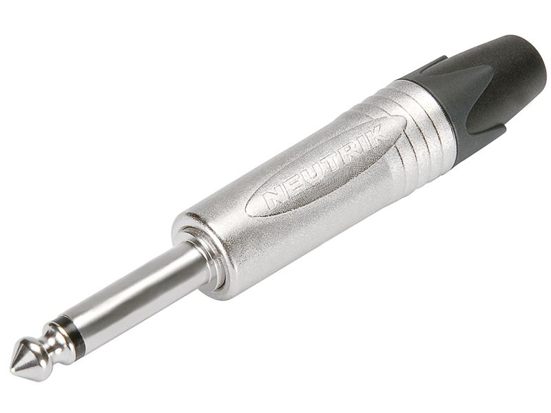
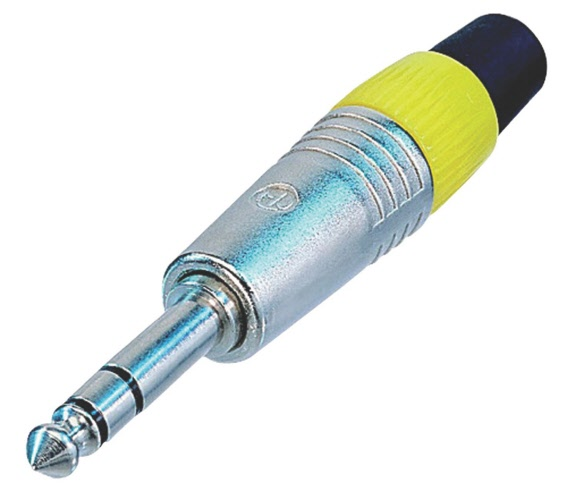
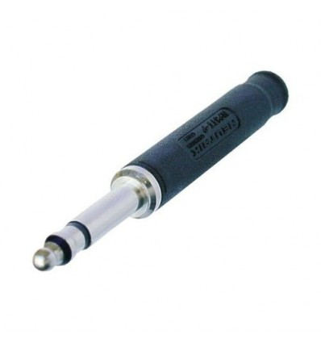
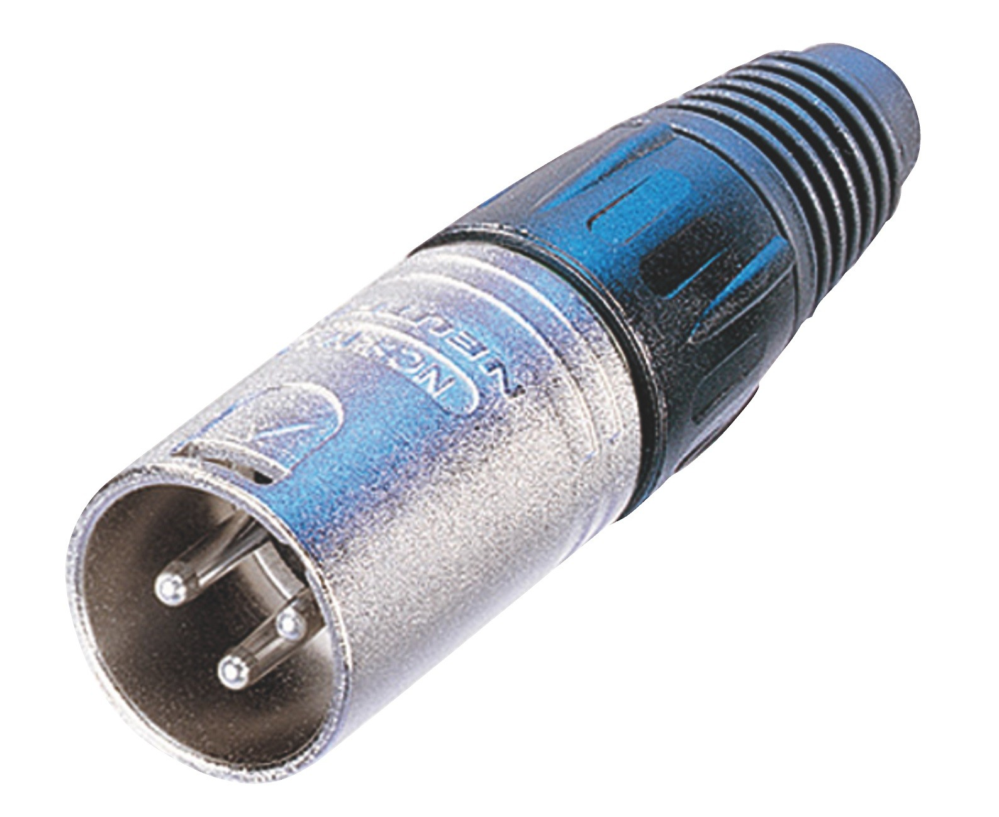
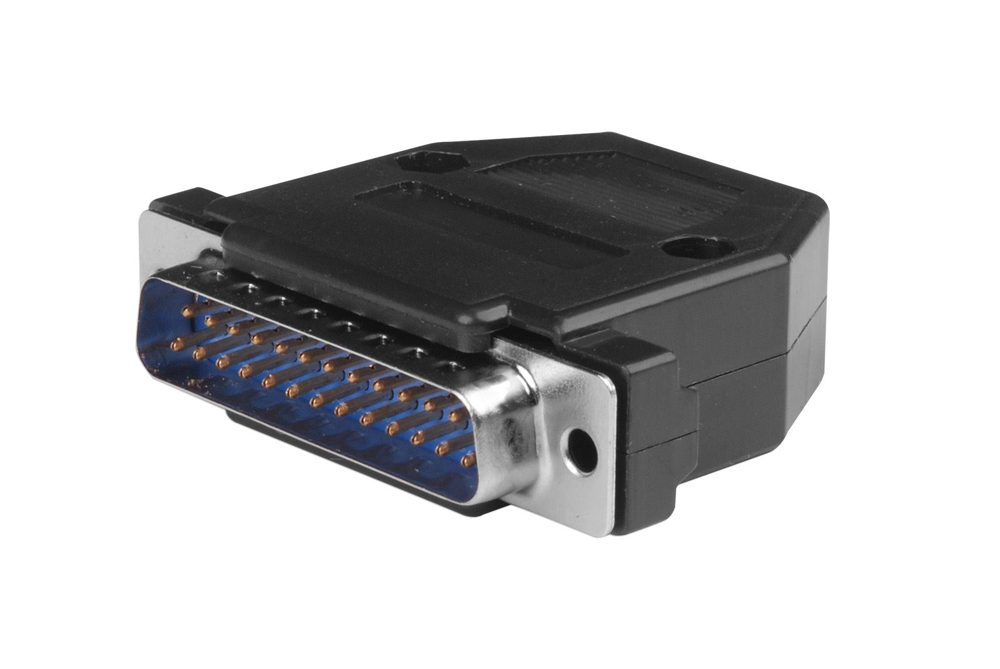

# Les modulations analogiques

Les câbles assurent le transport de signaux électriques. Ces signaux peuvent représenter une onde sonore (précédemment captée par un microphone), une valeur de contrôle pour piloter un appareil (pédale d’expression) ou encore une information numérique (câble USB, ethernet, etc.). Nous aborderons ici les câbles dédiés aux modulations analogiques, et tout particulièrement à l’audio.

Le principe de transport d’un signal analogique est assez simple. Pour une modulation, il faudra au moins un conducteur pour véhiculer le signal, et un conducteur pour la référence de tension, la masse. Pour transporter un signal supplémentaire, on conservera le même conducteur pour la référence et l’on en ajoutera un pour véhiculer le signal supplémentaire, faisant ainsi un total de trois conducteurs.

## Anatomie d’un câble

Les câbles véhiculant un seul signal sont généralement constitués de quatre à cinq composants :

+ d’un cœur composé d’un filament (souvent multibrin) en un métal conducteur, véhiculant le signal électrique.
+ d’une gaine isolante (plastique) protégeant le cœur
+ d’une tresse en cuivre connectée à la masse
+ Parfois, d’une feuille de cuivre, enrobant la tresse, permettant de réaliser une cage de faraday et de protéger le cœur des ondes électromagnétiques.
+ Enfin, d’une dernière gaine isolante, permettant de protéger l’ensemble du câble.

Ceux permettant de transporter plus de signaux rajouteront des cœurs multibrins entourés de leur gaine isolante. La plupart du temps, les câbles véhiculent un ou deux signaux à la fois, mais certains permettent d’en acheminer beaucoup plus (multipaire, Sub-D). On appelle un câble en fonction de ses connecteurs (ou fiches).

### Longueur du câble, son et impédance

Étudions la section d’un câble à modulation unique. Nous pouvons faire plusieurs observations. Le fil conducteur du signal, généralement en cuivre, est d’une longueur non négligeable. Plus cette longueur est importante, plus ce fil aura une **résistance** importante. De plus, ce fil est séparé de la tresse de masse (élément également conducteur) par un isolant. Il existe donc un effet de **capacitance** entre le point chaud et la masse. Enfin, la tresse de masse peut être comparée à une bobine, et possède donc une **inductance**. Nous pouvons donc assimiler un câble à un circuit **RLC** filtrant le haut du spectre audio.

Physiquement, notre description précédente est valide, mais elle est à corréler à **l’impédance de sortie** de la source. Typiquement, lors de l’utilisation d’un microphone statique, son impédance est suffisamment faible pour que la longueur du câble soit totalement transparente. Certains microphones dynamiques ou à ruban, possédant une impédance plus élevée, peuvent très légèrement souffrir de la longueur du câble.

Ce phénomène d’altération du timbre à cause de la longueur d’un câble a surtout lieu avec les instruments électriques **passifs** (guitares et basses). L’impédance de sorte de ces instruments est tellement grande que l’on peut aisément entendre la différence de son entre deux câbles.

> Il est amusant de constater que certains musiciens utilisent ce phénomène, et jouent avec des câbles volontairement trop longs, pour atténuer le haut du spectre. Brian May et Eric Johnson en sont deux exemples.

### Les connexions asymétriques

Les connexions asymétriques permettent de transporter un signal entre une source et un récepteur. Il s’agit de la façon la plus simple de connecter deux appareils devant échanger des signaux. Cependant, sur de longue distance, le câble peut se comporter comme une antenne et induire sur le signal certaines ondes électromagnétiques (comme la radio). Ces connexions ne nécessitent qu’un fil conducteur par modulation.

### Les connexions symétriques

Le but de ces connexions est de palier au problème des connexions asymétrique. Dans l’appareil émetteur, le signal à transporter est dupliqué, et ce duplicata est inversé en phase. Cette étape s’appelle la **symétrisation**. 

<!-- TODO : graph-->

C’est deux signaux qui sont appelés point chaud (signal d’origine) et point froid (signal opposé en phase). Sur le trajet du câble, lorsqu’une perturbation électromagnétique est induite sur le signal, celle-ci s’inscrit en phase sur les deux conducteurs (point chaud et point froid). À l’arrivée, l’appareil récepteur inverse la phase du point froid et le somme avec le point chaud. Cette étape se nomme la **dé-symétrisation**. Ainsi le signal d’origine est sommé en phase, tandis que les interférences sont sommées hors phase et s’annulent.

Les connexions symétriques nécessitent deux fils conducteurs pour chaque modulation.

## Les fiches & connecteurs

```{r, echo=FALSE, fig.cap="Jack TS, Jack TRS, Jack Bantam, XLR, Sub-D 25", fig.show="hold", fig.align="center", out.width="20%"}







```

On appelle « fiche » les éléments mécaniques situés aux extrémités d’un câble et permettant sa connexion à un équipement. Celle-ci nous permet de facilement identifier le type de câble que nous avons entre les mains.

> Contrairement aux dires de certains mythes, majoritairement reliée à l’audiophilie, la différence de matériau utilisé pour le contact de la fiche n’a pas d’incidence sur le son.

On rencontre principalement les connectiques jack TS, jack TRS, jack bantam, XLR et Sub-D. Les fiches jack TS ont deux points de connexion. Les fiches jack TRS, XLR et bantam en ont deux. Les Sub-D 25 en possèdent vingt-cinq.

<!-- TODO : images fiches -->

Les fiches jack TS sont souvent utilisées sur les instruments électriques et électroniques (guitare, basse, synthétiseurs, etc.). Ces connexions sont nécessairement symétriques. Les jack TRS sont un peu plus rare et se trouvent généralement sur des instruments avec des sorties stéréophoniques, ou sur des équipements audio possédant des entrés/sorties symétriques. La connectique XLR remplit fondamentalement le même usage qu’un jack TRS, mais offre un verrouillage mécanique, permettant de sécuriser la connexion. On la trouve principalement sur les microphones et sur préamplificateurs. L’avantage du jack TRS est son plus faible encombrement mécanique. On le préfère donc sur les appareils possédant un grand nombre d’entrées/sorties. Le jack bantam se trouve sur les boîtiers de patch. Leur petite taille permet une grande densité de point de connexion. Les patchbay prennent ainsi moins de place. On trouve aussi les connectiques Sub-D 25, principalement pour remplacer des connexions XLR. En effet, une seule connectique Sub-D 25 permet de remplacer huit câbles XLR.


## Exemples pratiques

### Câble jack « mono »

Ce type de câble est souvent utilisé sur les instruments électriques. On l’appelle « mono » car il ne véhicule qu’un seul signal.

### Câble jack « stéréo »

L’appellation de ce câble est ambiguë. Le terme stéréo fait référence à ses deux voies de connexion, cependant, le nom « stéréo » impliquerait qu’une des voies est destinée à alimenter l’enceinte gauche, et l’autre, le canal droit. Or, ce type de câble peut également convenir pour des connexions symétriques.

> On notera qu’il est possible de brancher un câble jack TS dans une fiche TRS. Un seul des canaux sera alors acheminé.

### Câble « Y »

Ces câbles possèdent trois connecteurs, et sont le plus souvent équipés de jack TS. Ils permettent de récupérer un signal pour le transmettre sur deux appareils. Attention, la duplication du signal étant passive, on risque un problème d’impédance si l’impédance d’entrée des deux appareils est trop différente. Le cas d’école est souvent rencontré lorsqu’on branche deux casques sur le même amplificateur. Si l’impédance des deux casques est trop différente, un des deux aura presque l’intégralité du niveau du signal alors que l’autre sous-modulera.

### Les connexions d’insert

Ces câbles ont la particularité d’avoir une fiche jack TRS et deux fiches jack TS. En studio, on les rencontre très souvent pour insérer un périphérique de traitement dans la chaîne audio. Le « tip » du jack TRS est connecté au « tip » d’un des jack TS qui est connectés sur l’entré du périphérique. Le deuxième jack TS est raccordé à la sortie de l’appareil et son « tip » est connecté au « ring » du jack TRS.

Ces câbles sont aussi utilisés pour séparer une sortie dite « stéréo » en deux voies « mono ».

## Routage des signaux

En studio d’enregistrement, il n’est pas rare de rencontrer plusieurs cabines de prise de son, chacune équipée de boîtier de patch. Ces boîtiers sont constitués d’un certain nombre d’entrées XLR. On achemine ensuite les sorties de ces boîtiers via des multipaires jusqu’à une « patchbay ». Le rôle de la « patchbay » est de permettre de connecter n’importe quelle entrée (signal provenant d’un microphone) vers n’importe quel préamplificateur.

On trouve évidemment beaucoup d’usage à ces « patchbay ». Elles sont à considérer comme la matrice de routage d’un studio d’enregistrement.