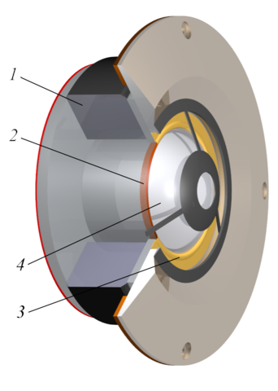

# Enceintes et amplificateurs

Un haut-parleur est un appareil permettant de transformer une énergie électrique en énergie mécanique. On l’appelle, plus spécifiquement, un transducteur électroacoustique. Fondamentalement, il s’agit d’un appareil extrêmement proche d’un microphone. D’ailleurs, il est possible d’utiliser un haut-parleur comme microphone, et vice-versa. Les haut-parleurs ont de faibles rendements, il est donc nécessaire d’amplifier les signaux grâce à des amplificateurs de puissance en amont.

De tous les équipements audio nécessaires pour réaliser une prise de son, les enceintes (et les casques) sont certainement les plus importants. En effet, c’est à travers leur prisme que nous pourrons écouter et contrôler notre travail. Il est donc crucial d’utiliser des écoutes regroupant un certain nombre de critères et, surtout, de les connaître sur le bout des doigts.

## Anatomie d’un haut-parleur

```{r, echo=FALSE, fig.align="center", fig.cap="Coupe de hautparleur (dans l'ordre, woofer, mid-range, tweeter). Infographie par Svjo, CC BY-SA 3.0", fig.show="hold", out.width="25%"}




```

Sur les schémas ci-dessus, nous trouvons les éléments suivants :

1. L’aimant
2. La bobine
3. La suspension
4. La membrane

La plupart des haut-parleurs sont qualifiés de **dynamiques**. La membrane du haut-parleur est reliée à une bobine, elle-même entourée par un système d’aimants. Lorsqu’un courant est appliqué aux bornes de cette bobine, sa position change dût à la modification du champ électromagnétique. Si le courant oscille, la bobine oscille de façon analogue, entraînant la membrane et permet donc la reproduction du son.

On appelle généralement « subwoofer » les haut-parleurs conçus pour retranscrire les fréquences très graves (20-200 Hz), « woofer » les haut-parleurs dédiés aux fréquences graves (50 Hz à 1000 kHz), « mid-range » les haut-parleurs du médium (1 kHz à 6 kHz), et « tweeter », ceux de l’aigu (au-delà de 5 kHz).

Le haut-parleur est sans doute l’appareil audio le plus imparfait qui soit. Il est sujet à de nombreuses sources de distorsion du signal.

Nous ne savons pas fabriquer des haut-parleurs capables de reproduire uniformément toutes les fréquences. Ces derniers sont souvent spécialisés dans une certaine plage de fréquence. La plupart des enceintes de monitoring utilisent 3 voies : deux actives (utilisant des haut-parleurs) pour l’aigu et le médium, et une passive (évent avant ou arrière) pour le grave. L'utilisation du plusieurs voies imposent donc l'utilisation de filtres induisant un déphasage de certaines fréquences.

Également, un haut-parleur peut être approché par un modèle « masse-ressort ». Cela signifie qu’il y a une certaine inertie à sa mise en action et une certaine inertie à sa mise en arrêt. L’enceinte idéale devrait posséder une inertie nulle. Cette inertie est potentiellement responsable d’un adoucissement des transitoires et d’une sensation de flou.

## Amplification et impédance

Nous avons précédemment abordé le préamplificateur, qui permet d’amplifier la tension d’un signal audio analogique et d’en baisser son impédance. On appelle alors « amplificateur » un amplificateur de **puissance**. La puissance d’un signal s’exprime par la relation ci-dessous. On cherche donc à augmenter la tension **et** l’intensité du signal.

$$ P = U \times I $$

Nous pouvons rapidement aborder la notion de classe d’amplification. En audio, nous n’utilisons que les classes A, AB et D. La classe A utilise un transistor (ou tube) pour amplifier l’ensemble du signal. Elle possède un très mauvais rendement. Cela signifie qu’il faut fournir beaucoup d’énergie au transistor pour un faible gain sur la puissance du signal. La classe AB utilise deux transistors, un pour les alternances négatives et un pour les alternances positives. Le rendement est meilleur que pour la classe A. Cependant, le point de raccordement entre les deux transistors est assez sensible et peu généré de la distorsion sur le signal (distorsion de croisement). La classe D, aussi appelée à tort « numérique », utilise un transistor afin d’indiquer l’état du signal. On retrouve donc la même idée que dans l’échantillonnage du signal. Ces amplificateurs offrent un **excellent rendement**.

Nous avons également abordé précédemment la notion d’adaptation d’impédance en tension, sans aborder l’adaptation d’impédance en puissance. Pour rappel, afin de préserver la tension entre deux appareils A et B, nous faisons en sorte d’avoir une faible impédance à la sortie de l’appareil A et une grande impédance à l’entré de l’appareil B. Pour préserver la puissance du signal, ce paradigme ne fonctionne plus. On cherche alors à avoir la même impédance entre la sortie d’un appareil et l’entrée d’un autre. En pratique, on raccordera, sur la sortie « 8 ohms » d’un amplificateur, un haut-parleur ayant une impédance de « 8 ohms ».

> On remarque qu’ici, les impédances sont extrêmement faibles. Les impédances typiques des haut-parleurs (et donc des sorties d’amplificateurs en puissance) sont 4, 8 et 16 ohms.

La plupart des enceintes de monitoring ont aujourd'hui une amplification de classe D directement intégré.

## Puissance et sensibilité

On trouve généralement deux mesures de la puissance pour les enceintes. La puissance **crête à crête** (peak) et la **puissance moyenne** (**RMS**, ou **Root Mean Square**). La puissance se calcule grâce à la formule suivante :

$$ P =\frac {U^2}{Z} $$

$P$ est la puissance, $U$ la tension et $Z$ l’impédance. Pour réaliser la mesure de puissance d’un haut-parleur, on le soumet à un signal test, en général un bruit rose, pendant plusieurs heures. La puissance crête à crête se calcul grâce à la tension crête à crête (aussi dite maximale). Par exemple, pour une tension maximale de 100 V, sous une impédance de 8 ohms, on trouve une **puissance crête à crête** d'environ 1200 watts (abbrégé W). On considère généralement que la tension moyenne d'un signal est six décibels plus petite que sa tension maximale. En reprenant notre exemple, pour une tension maximale de 100 V, on a une tension moyenne de 50 V, sous une impédance de 8 ohms, on trouve une **puissance moyenne** d'environ 300 W.

Alors, il faut donc faire très attention sur les spécifications données par les constructeurs, parfois volontairement floues. À défaut, si on lit que la puissance admissible d'un haut-parleur est de 1000 W, on supposera par défaut qu'il s'agit d'une puissance crête à crête. On ne dépassera donc pas une puissance moyenne d'amplification de 250 W.

La **sensibilité** est une mesure du niveau sonore à un mètre de l'enceinte pour une puissance RMS d'entrée d'un watt. Grâce à cette valeur, on peut calculer le niveau sonore produit par le haut-parleur à diverses distances et en fonction de différentes puissances d'entrées. On comprend aussi que la puissance électrique admissible dans l'enceinte ne donne que peu d'information sur son niveau sonore de sortie.

## Conseils pratiques

### Choisir une paire d’écoutes

Choisir une paire d’enceintes peut sembler être un exercice difficile. Il existe énormément de modèles, coûtant de quelques dizaines d’euros à plusieurs dizaines de milliers.

Il y a cependant plusieurs critères assez objectifs pour évaluer la qualité d’une enceinte :

1. La réponse en fréquence : l’enceinte flatte-t-elle particulièrement une zone du spectre ? En délaisse-t-elle une autre ?
2. La réponse en transitoires : les attaques sont-elles respectées ? Retrouve-t-on l’énergie initiale du signal ?
3. La linéarité en fonction du volume : a-t-on une sensation de compression du signal lorsque l’on augmente le niveau envoyé dans l’enceinte ?
4. Le centre fantôme : le centre du système stéréophonique paraît-il stable ? Paraît-il précis ?
5. La couleur sonore de l’enceinte : a-t-on plaisir à écouter du son et de la musique sur ce système ?

### Placer correctement son écoute

Afin de satisfaire les critères de la stéréophonie, il convient de respecter les règles suivantes :

+ Les deux enceintes doivent être de même marque, de même modèle et appairée. Si une des membranes a dû être changée sur l’une d’elle, l’autre aurait dû recevoir la même opération.
+ Les deux enceintes doivent être séparées par un angle de 60°
+ L’auditeur doit être placé à équidistance des deux haut-parleurs, et regarder vers le milieu du segment formé par les deux enceintes.

Une fois ces critères respectés, voici quelques conseils sur le placement des enceintes dans une pièce :

On préférera des pièces de grandes tailles, afin de repousser au maximum le temps d’arrivée des premières réflexions. Le système stéréophonique devrait être positionné dans un souci de symétrie : l’enceinte de gauche ne devrait pas être plus proche d’un mur que l’enceinte de droite, par exemple. Dans le cas de petit espace, on préféra coller les enceintes contre un mur. Cela permettra de supprimer l’influence d’une des premières réflexions au prix de l’augmentation du niveau de grave. Il est vivement recommandé de procédé au traitement, même minimal, acoustique de la pièce de travail, à commencer par les zones de réflexions premières et par les angles (ou le grave va s’accumuler). Si le traitement acoustique n’est pas envisageable, il convient de privilégier une écoute à faible niveau et une proximité maximale avec les enceintes.

## L'écoute au casque

Le casque est un outil permettant d'écouter un signal tout en s'extrayant de son environnement (acoustique et/ou bruit). Cependant, de par son mode de fonctionnement, à savoir deux haut-parleurs placés dans une enceinte en contact direct avec les oreilles, il génère un certain nombre de déformations.

Premièrement, la stéréophonie écoutée au casque est hypertrophiée. En effet, dans ces conditions d'écoutes, l'oreille gauche n'entend que le haut-parleur gauche et l'oreille droite n'entend que le haut-parleur droit.

Deuxièmement, il est très difficile de trouver des casques avec une réponse en transitoire satisfaisante. Il convient donc d'être excessivement prudent lorsque l'on mix du contenu percussif sur un casque.

Troisièmement, les casques sont encore moins linéaires en fréquence que les haut-parleurs, il convient là aussi d'être très prudent lors de la réalisation d'un mixage.

Ces défauts peuvent être compensés par l'habitude et la connaissance du système d'écoute, mais la transportabilité d'un mixage (à savoir, sa compatibilité avec d'autres systèmes d'écoute) réalisé au casque est souvent discutable.

### Casque fermé ou casque ouvert ?

Le casque fermé, comme son nom l'indique, propose une fabrication enfermant le haut-parleur dans une enceinte close. Cette méthode de fabrication offre l'avantage d'isoler celui qui écoute de l'environnement, mais aussi d'isoler l'environnement de ce qui est diffusé dans le casque. Par contre, ces casques ont souvent une réponse en fréquence très accidentée, et ne sont pas recommandés pour le mixage. Il est par contre vivement recommandé pour les musiciens en session de prise de son.

Le casque ouvert, à l'inverse de son homologue fermé, n'offre aucune isolation acoustique, au prix d'une meilleure réponse en fréquence du casque. Ces casques sont tout indiqués pour le mixage, mais beaucoup moins pour des situations de prise de son.