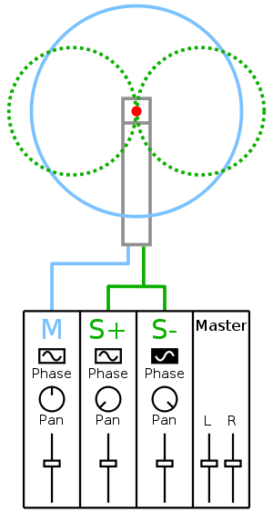

# La prise de son au couple

La prise de son au couple stéréophonique regroupe l’ensemble des techniques de prise de son dédié au système d’écoute stéréophonique (deux enceintes séparées de 60° et orientées vers un auditeur placé à équidistance des deux transducteurs).

Ces techniques permettent une bien meilleure représentation des espaces des prises de son ainsi qu’une localisation des différents éléments enregistrés dans cet espace.

## Généralités sur les mécanismes de la localisation du son par l’oreille humaine

Afin de mieux comprendre comment fonctionne un couple de prise de son, il convient d’étudier rapidement les principes fondamentaux de notre écoute.

Notre capacité à localiser les sons dans l’espace repose principalement sur deux mécanismes :
+ La différence de temps
+ La différence de niveau

### La localisation par différence de temps

Nos oreilles sont espacées, d’environ 15 à 25 cm. Cette distance implique qu’un son émis plus proche de l’oreille droite arrivera également plus tôt qu’à l’oreille gauche. Cet écart de temps, de quelques millisecondes, est suffisant pour donner à notre cerveau un indice sur la localisation du son.

Afin de sentir l’ordre de grandeur en jeu, calculons la différence de temps ($\Delta t$) maximale pour un individu possédant un écart d’oreille de 20 cm.

On sait que la célérité du son dans l’air vaut $c = 340 m.s^{-1}$, et est invariant en fonction de la fréquence. On sait également que $c = \frac{d}{t}$.

Dès lors, si on pose $d = 20 cm$ soit $d = 0.2 m$, on peut en déduire que :

$t = \frac{d}{c} \iff t= \frac{0.2}{340} \approx 0.0006 s \approx 0.6 ms$

Afin de mettre en relief ce résultat, il est communément admis que l’oreille humaine commence à faire la différence entre deux répétitions d’un même son à partir de $20 ms$.

### La localisation par différence d’intensité

A priori, l’espace entre nos deux oreilles n’est pas creux. La densité de notre crâne et de son contenu va réfléchir et absorber une partie des fréquences rencontrées.

Également, la partie externe de nos oreilles, appelées pavillon, permet, grâce à sa forme, de donner une directivité à notre écoute.

En d’autres termes, notre tête et le pavillon de nos oreilles se comportent comme un filtre, variant en fonction de l’angle d’incidence de la source. Cette altération du timbre n’est pas perçue comme une coloration, mais bien comme une information de localisation. La modélisation mathématique de ces filtres se retrouve dans la littérature scientifique sous le nom **HRTF**.

Cette atténuation séquentiellement dépendante est décisive dans notre capacité à localiser les sons. On la retrouve communément sous le nom $\Delta i$.

### Prévalence fréquentielle de ces deux phénomènes

Il est communément admis que le $\Delta t$ aura une efficacité maximale dans les basses fréquences, et le $\Delta i$ dans les hautes fréquences.

## Principes de la prise de son au couple

Pour créer son effet stéréophonique, les couples de prise de son utilisent les mêmes mécanismes que notre écoute naturelle :

+ La différence de temps
+ La différence d’intensité

Il va de soi que, pour fonctionner de façon optimale, les microphones utilisés pour réaliser une prise de son stéréophonique doivent être de même marque, de même modèle et appairée.

> L'appairage garantit que les microphones aient des caractéristiques techniques suffisamment proches pour être considérés comme identiques.

Afin de manipuler ces mécanismes, le preneur de son peut jouer sur les paramètres suivant :

+ La directivité des microphones
+ L’angle entre les capsules
+ La distance entre les capsules

Modifier chacun de ses paramètres influe sur l’**angle de prise de son**. Plus l’ange de prise de son est faible, plus l’impression de stéréophonie sera grande. Plus l’angle de prise de son est grand, plus l’impression de stéréophonie sera faible, jusqu’à tendre vers la monophonie.

> Attention de ne pas confondre l’angle de prise de son avec l’angle entre les capsules.

### Comment choisir un angle de prise de son.

L’angle de prise de son est étroitement lié à la distance du couple par rapport à l’évènement sonore à enregistrer. En règle générale, plus le couple est loin des objets sonores à enregistrer, plus son angle de prise de son sera faible. À l’inverse, plus le couple sera proche, plus son angle de prise de son sera grand.

Ensuite, lors de la réalisation d’un couple de prise de son, il est commun d’enregistrer un ensemble d’éléments : plusieurs instruments (batterie), voire plusieurs musiciens (quatuor à corde, orchestre). L’objectif est bien souvent de retrouver une sensation de disposition des éléments dans l’espace proche de la situation réelle. On cherche donc un angle de prise de son suffisamment petit pour que les sources occupent l’intégralité de l’espace stéréophonique, mais également suffisamment grand pour ne pas créer une sensation de trou au centre.

### Comment réaliser un angle de prise de son.

Plusieurs outils existent pour aider le preneur de son à configurer son angle de prise de son correctement.

Il est important de commencer par évoquer les abaques de Michael Williams, ayant cherché à étudier l’angle de prise de son et ses qualités en fonction des paramètres vues précédemment. Les résultats de ses travaux se trouvent sur le site [mmad.info](https://www.mmad.info/MAD/2%20Ch/2ch.htm).

On trouve également beaucoup d’application mobile, comme celle du constructeur du microphone Neumann, s’appuyant sur les travaux de Michael Williams pour aider leurs utilisateurs à correctement positionner leurs microphones. Évidemment, et heureusement, rien n’est spécifique à un fabricant de microphones en particulier, l’application d’un constructeur A peut servir pour placer des microphones d’un constructeur B.

Plus récemment, des chercheurs britanniques ont développé une application, nommée [MARRS](https://marrsweb.hud.ac.uk/), permettant de positionner son couple de prise de son par rapport aux sources via une interface graphique très simple à utiliser. Cette application est disponible sur mobile et sur navigateur internet.

### Privilégier le $\Delta i$ ou le $\Delta t$ ?

La différence de perception du champ stéréophonique est très différente entre celui produit par le $\Delta i$ ou par le $\Delta t$.

+ Un couple reposant sur le $\Delta i$ aura une sensation de localisation des sources précise. De plus si un tel couple enregistre une source ce déplaçant a vitesse constante, la sensation de déplacement retranscrite par le couple sera, elle aussi, linéaire. Il est également possible de sommer les deux microphones ensemble afin d’obtenir un signal monophonique. Un tel couple est appelé compatible mono.
+ Un couple reposant sur le $\Delta t$ aura une sensation de localisation plus floue, mais apportera un sens de l’espace plus grand et une dimension spacieuse. À l’inverse d’un couple $\Delta i$, la sensation d’un déplacement linéaire d’une source n’est pas linéaire. Il n’est pas possible de sommer les deux capsules pour en obtenir une réduction mono sans générer des altérations de timbre sévères.

Chaque couple possède ses avantages et ses inconvénients. Heureusement, nous ne sommes pas limités à l’un où l’autre et nous pouvons à loisir réaliser une combinaison des deux mécanismes.

## Les topologies classiques de prise de son au couple

Le premier ingénieur à se poser la question du son stéréophonique est l’anglais Alan Blumlein en 1929. Il imagine l’entièreté de la chaîne d’enregistrement et de diffusion nécessaire à la stéréophonie. Cependant, la BBC lui impose comme contrainte que toutes ses propositions soient compatibles avec des systèmes monophoniques. Il inventera donc le couple XY et MS.

Plus tard, la plupart des radios européennes développeront des couples de prises de son mêlant $\Delta i$ et $\Delta t$, tel que l’ORTF.

### Le couple Blumlein / XY

Les deux microphones sont ici directifs, placés au même point de l’espace et ongulé d’une certaine valeur entre eux.

De par les contraintes technologiques de son époque, Blumlein a décrit ce couple pour une utilisation de deux microphones bidirectionnels. Il est aujourd’hui plus commun de le rencontrer avec deux cardioïdes.

Dans sa version originale, le couple Blumlein comprend donc deux microphones bidirectionnels avec un angle de 90°.

La formulation du couple XY comprend deux microphones cardioïdes avec un angle compris entre 90° et 135°.

### Le couple MS

Le couple MS, également inventé par Alan Blumlein, permet de doser la quantité de stéréophonie après l’enregistrement.

Pour se faire, ce couple utilise deux microphones :

+ Un omnidirectionnel, historiquement, mais aujourd’hui fréquemment remplacé par un microphone cardioïde.
+ Un bidirectionnel

Le microphone omnidirectionnel, ou cardioïde, va rendre compte du centre de la stéréophonie, tandis que le microphone bidirectionnel rendra compte de la latéralité.

Une fois enregistrés, ces deux canaux ont besoin d’être convertis, plus exactement dématricés, vers une paire de canaux stéréophonique. L’opération est très simple :

$$L = M+S$$
$$R = M-S$$

Cette opération peut être réalisée sur une console de mixage, telle que décrite ci-dessous.

```{r chunk-label, echo = FALSE, fig.cap = 'Dématriçage MS', out.width="40%"}

```

### Le couple ORTF

Le couple ORTF, inventé par la radio française du même nom, combine l’effet du $\Delta i$ et du $\Delta t$ afin de s’approcher de l’écoute humaine.

Sa topologie est précisément définie. Elle propose l’utilisation d’une paire de microphones cardioïde, ongulé du 110° et avec un écart de 17 cm.

### Les couples AB

Les couples AB peuvent avoir une définition ambiguë. Une partie de la littérature scientifique considère comme couple AB tout couple non coïncident. À cet égard l’ORTF est considéré comme un couple AB. Pour d’autre, les couples AB ne concernent que des couples constitués de microphones omnidirectionnels.

Ces derniers ont la particularité de n’utiliser que le $\Delta t$ afin de placer les sources dans l’espace. Le rendu est donc souvent spacieux, au prix d’une certaine instabilité et d’un certain manque de précision de l’image stéréophonique.

## Compléter une prise de son au couple par des appoints

Il est commun, lors d’une prise de son au couple, de chercher à obtenir une entière satisfaction sonore à la seule aide du couple. Cependant, cela n’est parfois pas possible, souvent pour des contraintes physiques et acoustiques (un instrument de l’ensemble jouant moins fort que les autres). Dans ces cas, l’utilisation d’appoint, donc de microphone supplémentaire, placé en proximité de la source, va permettre de venir récupérer une précision supplémentaire de l’instrument.

Lors de l’étape de mixage, le couple servira de base principale et l’on viendra ajouter la quantité nécessaire d’appoints pour préciser le propos. Il sera parfois nécessaire de remettre en phase l’appoint et le couple pour améliorer la sommation de l’ensemble.

